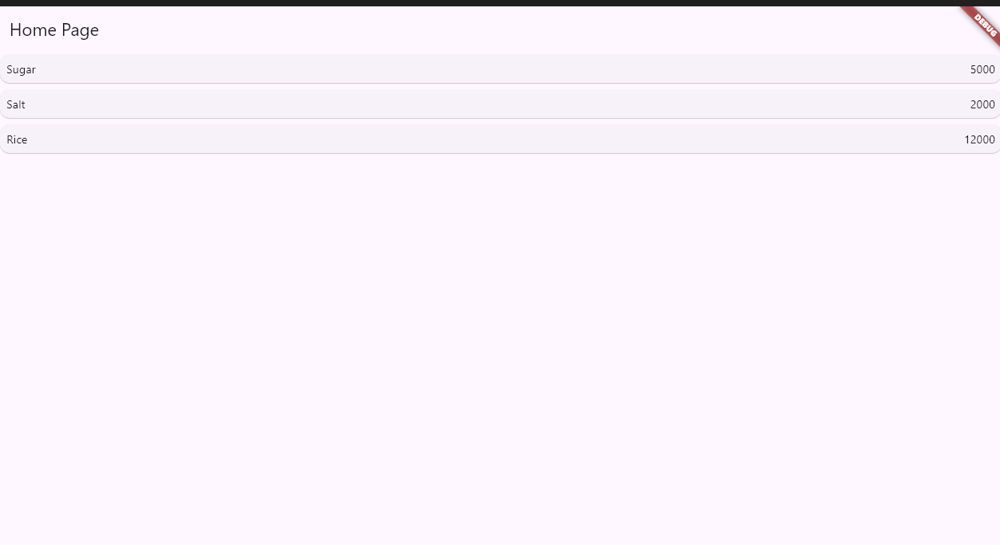
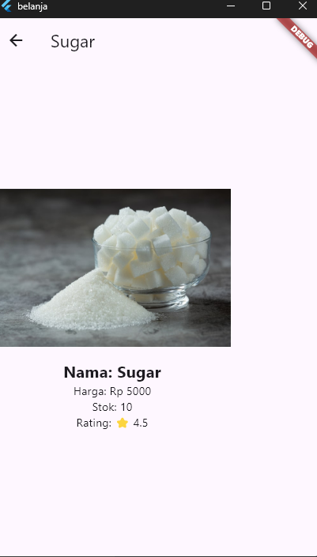

# 🛒 Praktikum Flutter - Navigasi & Data Model

## 👨‍💻 Author
- Nama  : Afgan Galih
- NIM   : 2341760004  
- Kelas : SIB - 3C  

## 📌 Deskripsi
Project ini adalah implementasi praktikum Flutter untuk memahami:
1. **Routing & Navigasi** antar halaman.
2. **Model Data** sederhana (`Item`).
3. **ListView.builder** untuk menampilkan data list.
4. **InkWell** untuk aksi saat item ditekan.

---

## ⚙️ Fitur Utama
- **HomePage**
  - Menampilkan daftar barang (`Sugar`, `Salt`, `Rice`) dalam bentuk `ListView`.
  - Setiap item ditampilkan dalam `Card` dengan nama dan harga.
- **ItemPage**
  - Menampilkan detail item yang dipilih dari HomePage.
- **Navigasi**
  - Klik pada item di HomePage akan membuka halaman detail di ItemPage.

---

## 🖥️ Screenshot

### 1. HomePage (List Item)
📸 Tampilan awal aplikasi menampilkan daftar barang.

---

### 2. ItemPage (Detail Item)
📸 Tampilan detail item setelah salah satu item ditekan.

### 3. HomePage (Tugas Praktikum)
📸 Tampilan detail item setelah salah satu item ditekan.

### 4. ItemPage (Tugas Praktikum)
📸 Tampilan detail item setelah salah satu item ditekan.

---

